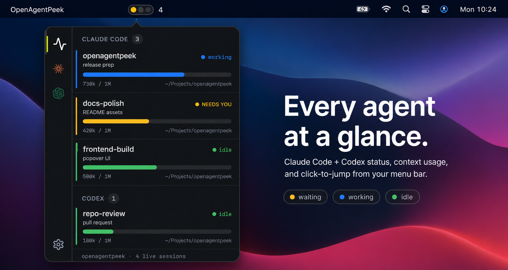

# OpenAgentPeek

[English](README.md) | 简体中文

**在菜单栏一眼看尽所有正在运行的 Claude Code 和 Codex 会话——并一键跳到正等着你的那一个。**

[](LICENSE)
-black)


AgentPeek 的开源免费版——一个 macOS 菜单栏小工具,盯着你所有正在跑的 Claude Code 和 Codex
会话,一眼告诉你哪个在干活、哪个空闲、哪个在等你。



## 它能做什么

- **一眼看全部。** 菜单栏里一盏红绿灯——🟡 有会话在等你、🔵 有会话在干活、🟢 都闲着——外加一个计数。
- **点一下就跳过去。** 点任意一个会话,它所在的窗口就弹到最前——不管是终端标签页、VSCode 窗口,
  还是 Codex 桌面应用。再也不用在一堆终端里翻找哪个卡住等你了。
- **上下文用量一目了然。** 每个会话都显示它的上下文窗口用了多少。
- **两家一起看。** Claude Code 和 Codex 并排显示。
- **只读、零配置。** 它只**读**这两个工具本来就在写的日志——绝不碰你的会话、不装任何钩子、不用任何设置。

## 为什么做它

并行跑好几个 agent 的时候,**你自己**反而成了瓶颈——那个在终端间来回切、找哪个停下来问你话的人。
OpenAgentPeek 把这个翻找,变成一眼 + 一点。

## 安装

> 仅限 macOS,Apple 芯片。

**[⬇ 下载最新 .dmg](https://github.com/zuoxu3310/openagentpeek/releases/latest)** —— 打开后把
OpenAgentPeek 拖进"应用程序"。

目前的包**未签名**,所以 macOS 首次打开会拦一下——右键点应用 → **打开**,或在终端跑
`xattr -cr /Applications/OpenAgentPeek.app`。第一次用"点击跳转"时,系统会问一次"是否允许控制终端"。

### 从源码构建

```bash
bun install
bun run tauri build    # 需要 Rust 工具链(. "$HOME/.cargo/env")+ bun
bun run tauri dev      # ……或开发模式运行
```

## 工作原理

Tauri 2(Rust)+ React。后端盯着 Claude Code(`~/.claude/projects`)和 Codex
(`~/.codex/sessions`)本来就在写的 JSONL 日志,把每个会话解析成"状态 + 上下文用量",每秒推一次给弹窗。
点击跳转靠的是按工作目录找到那个活着的进程、再把它的窗口唤到最前——全靠观察,不装钩子。
架构和源码地图见 [docs/ARCHITECTURE.md](docs/ARCHITECTURE.md)。

## 一起来建

OpenAgentPeek 是开源的,本来就想和你一起建。它还很年轻,有很多可以打磨的地方,欢迎参与:

- **发现 bug 或别扭的地方?** 开个 issue。
- **想要某个功能?** 先开 issue 聊聊形态,再动代码。
- **要提 PR?** 保持小而聚焦,确保 `cargo test` 通过——见 [CONTRIBUTING.md](CONTRIBUTING.md)。

适合上手的地方:给点击跳转加更多终端(iTerm2、Ghostty、WezTerm……)、接第三个 agent、或者打磨弹窗的设计。

## 用 AI 建成

OpenAgentPeek 几乎完全由 Claude Code 写成——设计、Rust、React、连这些文档——也是一次"agent 驱动开发
能在一个真能发布的应用上走多远"的实验。

## 致谢

- 建在 [openusage](https://github.com/robinebers/openusage) 的技术栈和视觉系统之上。
- 灵感来自 AgentPeek 的"一眼看尽所有 agent"。

## 许可

[MIT](LICENSE)
